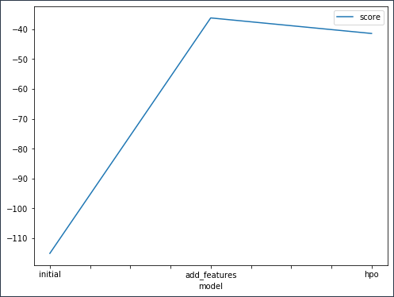
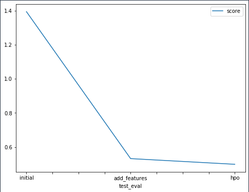

# Report: Predict Bike Sharing Demand with AutoGluon Solution
#### Salsabeel Tantoush

## Initial Training
### What did you realize when you tried to submit your predictions? What changes were needed to the output of the predictor to submit your results?
I realized that there were some negative values for RMSE metric score, I learned that these negtives are resulted when the estimated value is less than the actual value, thus, I got the count of the negative values and then changed them to 0, and assigned the results to the submission dataframe to be able to upload my predictions to kaggle, which does not accept negative values for predictions.

### What was the top ranked model that performed?
My top-ranking model was the one which I performed several HPOs on, which was the last model trained with a score of 0.49878.

## Exploratory data analysis and feature creation
### What did the exploratory analysis find and how did you add additional features?
After I plotted all the features, I noticed that 'casual', 'count' and registered' dominated the plot, which made me a bit hesitant about what conclusion I should reach and I think it is inconclusive, but the instructions were clear about the fact that we should plot all the features without dismissing any of them, that is why I left it as it is. 

### How much better did your model preform after adding additional features and why do you think that is?
The model improved remarkably, the RMSE Kaggle score went from 1.39380 to 0.53206, additional features give the model more insights on how these features correlate with each other and with their target values, so it helps the model to produce more accurate predictions.

## Hyper parameter tuning
### How much better did your model preform after trying different hyper parameters?
It did even better, the model scored 0.49878, compared to 0.53206, that is a significant improvement. 
### If you were given more time with this dataset, where do you think you would spend more time?
I would experiment with different algorithms like XGboost, and I would spend more time in EDA part as it is a bit ambiguous to me, the plots were not interpretable. 

### Create a table with the models you ran, the hyperparameters modified, and the kaggle score.
|model|time|num_boost_rounds|num_echos|score|
|--|--|--|--|--|
|initial|600|'default'|'default'|1.39380|
|add_features|600|'default'|'default'|0.53206|
|hpo|900|100|12|0.49878|
### Create a line plot showing the top model score for the three (or more) training runs during the project.

TODO: Replace the image below with your own.

### Create a line plot showing the top kaggle score for the three (or more) prediction submissions during the project.

TODO: Replace the image below with your own.

## Summary
To sum up, in this project I experimented with real world data, I used Autogluon to train and test several models and then select the best performing one, then I added some features and performed EDA and data cleansing to eliminate abnormalities in the data, and finally I optimized the hyperparameters to reach a better model performance.
